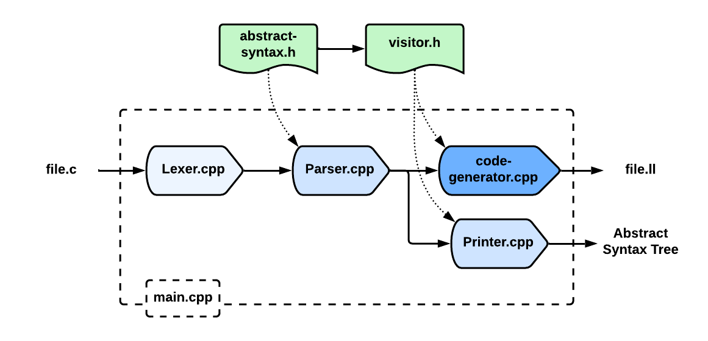

<h1 align="center">Compiling a Subset of C</h1>

<div align="center">


</div>

This compiler follows the [LLVM Kaleidoscope Tutorial](https://llvm.org/docs/tutorial/) to construct a recursive descent parser for a subset of the C language, albeit with some minor modifications/extensions.
I have also referred to [this repository](https://github.com/MarkLeone/WeekendCompiler) to better understand the LLVM code generation process and the application of the visitor pattern (as suggested by the tutorial).

## Installation

 0. Install the prerequisites: `clang`, `llvm17`, and `llvm-devel`<br>
   I used the `dnf` package manager, so package names may differ on other platforms<br>
   Alternatively, see [getting started](https://llvm.org/docs/GettingStarted.html#getting-the-source-code-and-building-llvm) and [official downloads](https://releases.llvm.org/download.html)
 1. Clone this repository
 2. Run `make` in the cloned directory
 3. Compile `file.c` with `./subc file.c`, resulting in `file.ll`
 4. Use `file.ll` by linking it in a separate `driver.cpp` file (and using it there);<br>
   see `tests/driver.cpp` for an example.

## Language Definition

The full grammar is shown in the `grammar.txt` file.
It is in LL(1) form and it enforces operator precedence.

The gist of the language is as follows:
 - Literals and variables are either *integers*, *floats* (in decimal form), or *booleans* (`true` and `false`)
 - Variable declarations **must** occur at the start of a code block! (However, nested code blocks are supported, allowing circumvention of this requirement)
 - Supported operations are:
   - Logical `||` and `&&`, with proper precedence and short-circuit evaluation
   - Logical negation (`!`)
   - Basic arithmetic (`+`, `-`, `*`, `/`, `%`)
   - Basic comparison (`==`, `!=`, `>=`, `>`, `<=`, `<`)
 - Supported control flow:
   - `if` blocks (with optional `else` blocks)
   - `while` blocks
   - Early `return` statements
 - Functions may return `void`
 - Functions may have no parameters, declared as `f()` (ie. no need for explicit `f(void)`)
 - Functions can only be overloaded based on parameter count

## Compiler Design

The design is textbook:
a simple character-by-character lexer feeds a recursive descent parser (which exactly mirrors the LL(1) grammar),
whose output is represented as a printed abstract syntax tree (albeit with minimal formatting) and then converted into LLVM's intermediate representation.

Some key points are as follows:
 - The abstract syntax 'components' are divided into three categories:<br>
   *expressions* (ie. anything that intuitively holds a specific value);<br>
   *statements*, which aggregate expressions and deal with control flow; and,<br>
   *top-level constructs*, which organise statements by functions, global declarations, and external linkages.<br>
   See `src/abstract-syntax.h` for details.
 - The two visitor classes mirror the first two categories above, largely to streamline code generation &mdash;
   expression generator (using the expression visitor) deals with low-level instructions and returns intermediate values, whereas
   statement generator (using the statement visitor) deals with blocks of instructions and their branching, directing their placement, but not returning any values.
   The top-level program generator simply initiates and organises the above.
   See `src/visitor.h` and `src/code-generator.cpp`.
 - The **biggest challenge** in writing the compiler was mirroring the **lazy boolean evaluation** of `clang`.
   My approach is to painstakingly identify the clauses of the boolean expression according to the disjunctive normal form, and
   then carefully generate the appropriate lazy branching instructions; to illustrate, consider the expression `x && y || a && b || c`:<br>
   if `x` is true then it is necessary to check `y`, if it is also true then it is necessary to jump just-after `c`,<br>
   if `x` is false then it is necessary to jump in-front of `a`,<br>
   if `a` is true then ...<br>
   See `generateLazyBooleanExpression()` in `src/code-generator.cpp`.

<p align="center">

</p>

## Example Program

Many example programs are shown in `tests/modules/`; one of them is as follows:

```c
int fibonacci(int n) {
  int total;
  total = 0;

  {
	int first;
	int second;
	int next;
	int c;

	first = 0;
	second = 1;  
	c = 1;

	while(c < n) {
	  if (c <= 1) {
		next = c;
	  } else {
		next = first + second;
		first = second;
		second = next;
	  }    
	  c = c + 1;
	  total = total + next;
	}
  }

  return total;
}
```
